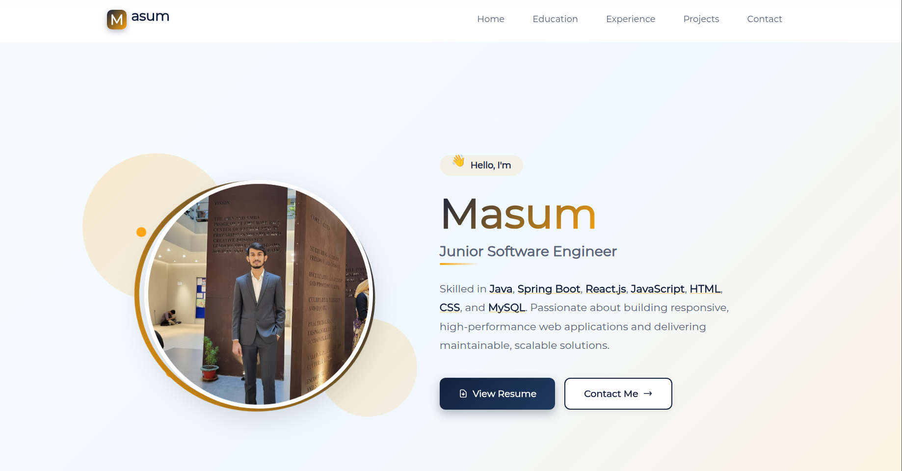
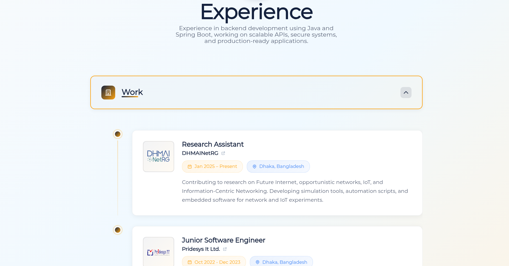

 <div align="center">

# 🌐 Personal Portfolio Website

A modern, responsive personal portfolio built with **React** — showcasing education, skills, projects, experience, and contact information.

🔗 **Live Demo:** [masum-mir.github.io/portfolio](https://masum-mir.github.io/portfolio/)

</div>

---

## 📸 Preview

<div align="center">

### Home Section


### Experience Section


</div>

---

## ✨ Features

- **Greeting / Hero Section** — Animated introduction with a personal tagline
- **Skills Section** — Visual display of technical skills and tools
- **Education Section** — Academic background and qualifications
- **Experience Section** — Work experience and research affiliations
- **Projects Section** — Highlighted personal and academic projects
- **Contact Section** — Interactive contact integration
- **Responsive Design** — Fully optimized for desktop, tablet, and mobile 
- **Smooth Animations** — Powered by `animate.css` and `GSAP`

---

## 🛠️ Tech Stack

| Layer | Technology |
|---|---|
| Framework | React 19 |
| Styling | SCSS (Sass), Bootstrap 5, Tailwind CSS |
| Routing | React Router DOM v7 |
| Icons | FontAwesome, Lucide React |
| Animations | Animate.css, GSAP |  
| Deployment | GitHub Pages (`gh-pages`) |

---

## 📁 Project Structure

```
portfolio/
├── public/                  # Static assets (favicon, manifest)
├── src/
│   ├── assets/
│   │   ├── fonts/           # Custom fonts (Google Sans, Montserrat, Agustina)
│   │   └── img/             # Images and logos
│   ├── components/
│   │   └── navbar/          # Navbar component
│   ├── containers/
│   │   ├── greeting/        # Hero / landing section
│   │   ├── skills/          # Skills section
│   │   ├── education/       # Education section
│   │   ├── experience/      # Experience section
│   │   ├── projects/        # Projects section
│   │   ├── contact/         # Contact form & map
│   │   └── error/           # 404 error page
│   ├── pages/               # Page-level wrappers for each section
│   ├── _globalColor.scss    # Global color/theme variables
│   ├── App.js               # Root component with routing
│   └── index.js             # React DOM entry point
├── resume.pdf               # Downloadable resume
└── package.json
```

---

## 🚀 Getting Started

### Prerequisites

- [Node.js](https://nodejs.org/) (v16 or higher recommended)
- npm

### Installation

```bash
# 1. Clone the repository
git clone https://github.com/masum-mir/portfolio.git
cd portfolio

# 2. Install dependencies
npm install

# 3. Start the development server
npm start
```

Open [http://localhost:3000](http://localhost:3000) in your browser.

---

## 📦 Available Scripts

| Command | Description |
|---|---|
| `npm start` | Run app in development mode |
| `npm test` | Launch test runner |
| `npm run build` | Build for production |
| `npm run deploy` | Deploy to GitHub Pages |

---

## 🌍 Deployment

This project is deployed via **GitHub Pages**. To deploy your own version:

1. Update the `homepage` field in `package.json` with your GitHub Pages URL.
2. Run:

```bash
npm run deploy
```

This will build the project and push it to the `gh-pages` branch automatically.
 
 
